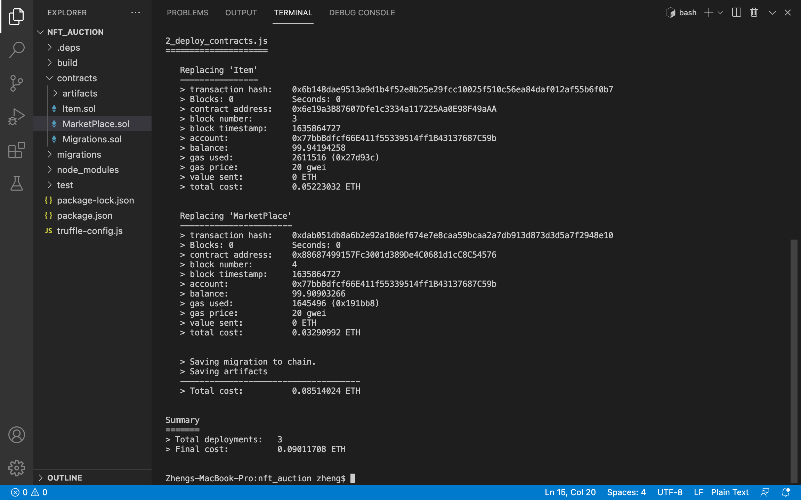

# README

## 项目简介

该项目实现的是一个 NFT 拍卖平台，其主要功能如下。

- 用户可以铸造 NFT，并且可以查看自己已经铸造的 NFT，自己正在拍卖的 NFT，目前拍卖进展和拍卖买入的 NFT。
- 用户可以选择铸造的 NFT 并进行拍卖，规定好起拍价格和截至时间。其他用户可以浏览正在拍卖中的 NFT，并进行出价。
- 用户可以查看正在拍卖NFT过去的所属权流转信息。
- 拍卖结束后，出价最高者需要手动去认领（Claim）NFT，合约会将这个NFT的所有权转到该用户的地址下。

## 依赖

### IPFS

在 [IPFS Distributions](https://dist.ipfs.io/#go-ipfs) 下载 Binary 文件。

在下载目录下输入以下命令。

```bash
tar -xvzf go-ipfs_v0.10.0_darwin-amd64.tar.gz
cd go-ipfs
bash install.sh
```

随后输入以下命令验证安装成功。

```bash
ipfs --version
```

### OpenZeppelin

如果使用 Remix 进行智能合约的开发，该步骤可以省略。由于我们使用 Truffle 进行智能合约的编译与部署，该步骤是必须的。

在智能合约项目根文件夹下输入以下命令。

```bash
npm install @openzeppelin/contracts
```

如果不进行此步，在合约中进行了以下`import`后使用`truffle compile`会无法编译。

```solidity
import "@openzeppelin/contracts/token/ERC721/ERC721.sol";
```

### Ganache

进入 Ganache 官网，下载安装包进行安装。

### Truffle

命令行中输入以下命令安装。

```bash
npm install -g truffle
```

### Metamask

访问 [MetaMask](https://chrome.google.com/webstore/detail/metamask/nkbihfbeogaeaoehlefnkodbefgpgknn?hl=en)，将该插件添加到 Chrome。

### React

命令行中输入以下命令安装。

```bash
npm install -g react
```

## 运行前的准备工作

请按照以下步骤进行运行前的准备工作，因为一些步骤的进行需要前面步骤的完成。

### 启动 IPFS Daemon

在命令行中输入以下命令启动 IPFS daemon。

```bash
ipfs daemon
```

### 启动 Ganache


### 编译部署智能合约

进入智能合约项目根文件夹（该文件夹由`truffle init`命令创建），输入以下命令。

```bash
truffle migrate
```



### 合约地址设置与 ABI 文件拷贝

在前端项目根文件夹中对`src/eth/Item/Item.js`与`src/eth/MarketPlace/MarketPlace.js`进行设置，将文件中的`contractAddr`分别设置成上一步中编译结束后命令行输出的相应内容。

由于我们的合约项目文件夹与前端项目文件夹是分开的，因此我们需要把包含智能合约 ABI 的文件拷贝到前端项目文件夹中。具体而言，将智能合约项目根文件夹下`build/contracts/Item.json`拷贝到前端项目根文件夹下`src/eth/Item/Item.json`，将智能合约项目根文件夹下`build/contracts/MarketPlace.json`拷贝到前端项目根文件夹下`src/eth/MarketPlace/MarketPlace.json`。

### 导入账号至 Metamask

将启动的 Ganache 中前两个账号的私钥导入到 Metamask 中。


### 启动前端

进入前端项目根文件夹，输入以下命令。

```bash
npm install
npm run start
```

## 主要功能截图

首先登陆账号1。

初始化界面，从智能合约同步信息。


铸造 NFT，需要输入名称、描述，并上传文件。


铸造成功后会在个人“资产”页面显示铸造的 NFT。


创建拍卖，需要设置初始价格（单位为 ether）与持续时间（单位为分钟）。


创建拍卖成功后，会在“创建的拍卖”页面显示。


登陆账号2。

在“市场”页面看到当前活跃的拍卖。


进行出价。


提交出价后可以在“参加的拍卖”页面显示参加过的拍卖。


拍卖截止时间后，认领期限前，可以进行申领。


申领后，出现在“资产”页面，可以对拥有的资产进行拍卖。


在“市场”页面可以查看拍卖品的详细信息。


登陆账户1，设置低于起始价格的出价，无法完成。


登陆账户2，对自己的拍卖品进行出价，无法完成。


## 注意事项

以下是该平台的一些规则，使用时需要特别注意。

- 拍卖结束后需要在固定期限内申领，否则拍卖品将退回给 NFT 主人。
- 申领后，需要等到上次拍卖申领截止后才能创建新的拍卖。
- NFT 拍卖创建者不能参与出价。

## 评论

该项目虽然功能完成度相对较高，但是界面略为简陋，未来有进一步提升的空间。